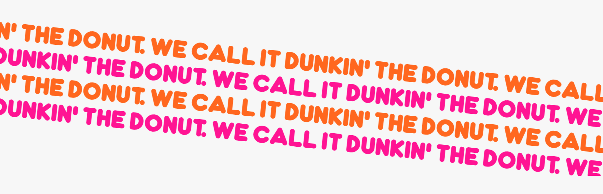

# Procesverslag

Markdown is een simpele manier om HTML te schrijven.  
Markdown cheat cheet: [Hulp bij het schrijven van Markdown](https://github.com/adam-p/markdown-here/wiki/Markdown-Cheatsheet).

Nb. De standaardstructuur en de spartaanse opmaak van de README.md zijn helemaal prima. Het gaat om de inhoud van je procesverslag. Besteedt de tijd voor pracht en praal aan je website.

Nb. Door _open_ toe te voegen aan een _details_ element kun je deze standaard open zetten. Fijn om dat steeds voor de relevante stuk(ken) te doen.

## Jij

  
uitwerken voor kick-off werkgroep

### Auteur:

Hidde van der plaat

#### Je startniveau:

Rode piste

#### Je focus:

Responsive focus

## Je website

  
uitwerken voor kick-off werkgroep

### Je opdracht:

[Dunkin Donuts](https://www.dunkin.nl/)

#### Screenshot(s) van de eerste pagina (small screen):

Dunkin Donuts Home Page

 

#### Screenshot(s) van de tweede pagina (small screen):

Dunkin Donuts About Page

 

## Toegankelijkheidstest 1/2 (week 1)

  
uitwerken na test in 2e werkgroep

### Bevindingen

Lijst met je bevindingen die in de test naar voren kwamen:

- Op de website van Dunkin zijn een hoop plekken niet of slecht voorzien van een ALT. Voor screenreaders is het dus niet duidelijk waar bepaalde dingen staan.
- Headers staan niet overzichtelijk en vaak niet eens als Header in de HTML.
- Knoppen en links worden qua uiterlijk vaak door elkaar gebruikt.
- Veel animaties en geen mogelijkheid voor minder animatie, darkmode of high contrast mode.
- Ook kunnen de font-sizes niet aangepast worden.
- Op telefoon is viewportzoom uitgeschakeld.

## Breakdownschets (week 1)

  
uitwerken na afloop 3e werkgroep

  
### de hele pagina:
Breakdownschets Home

  

Breakdownschets About

  

### dynamisch deel (bijv menu):

### wellicht nog een dynamisch deel (bijv filter):

## Voortgang 1 (week 2)

  
uitwerken voor 1e voortgang

### Stand van zaken

Ben begonnen met het maken van de top nav. alleen lastig om te maken met Flexbox. Grid geprobeerd en dit ging vrij goed, ongeacht dat ik dit weinig eerder heb gebruikt.

### Agenda voor meeting

samen met je groepje opstellen

| Hidde                          | Karenza | student 3 | student 4 |
| ------------------------------ | ------- | --------- | --------- |
| Span en gradient voor knopjes? |         |           |           |
| Vh of breakpoints voor resp.?  |         |           |           |
| Top nav mogelijk in flex?      |         |           |           |

### Verslag van meeting

hier na afloop snel de uitkomsten van de meeting vastleggen

- Span en gradient is goed
- vh of clamp() breakpoints kan een goede manier zijn
- grid goed gedaan. alleen zijdes met padding doen.
- ...

## Voortgang 2 (week 3)

  
uitwerken voor 2e voortgang

### Stand van zaken

Het responsive maken gaat nog lastig maar ik merk dat er vooruitgang in zit. Ben nog niet begonnen aan JS.

### Agenda voor meeting

samen met je groepje opstellen

| Hidde                   | Zineb                    | Caynalin                     | Danisha              |
| ----------------------- | ------------------------ | ---------------------------- | -------------------- |
| @media voor resp. font? | css class voor pag. ?    | Waar bg paatsen?             | Hoe bg toepassen?    |
| Main indeling ?         | Veel code voor section ? | Meer h2 elem. ?              | Resize zonder verv.? |
| Resp. Grid-templ.?      | h1 niet boven grid ?     | Hoe weet scr welke h2 bij p? |                      |
| Percentages voor size ? | Hoe grid resp. ?         | Correct span,img in h2?      |                      |
|                         | div, sect. voor box ?    | Secie 3 iconen toep. ?       |                      |
|                         |                          | b,br gebruik ?               |                      |
|                         |                          | Sectie 4 goed? img,h2,h3 etc |                      |

### Verslag van meeting

hier na afloop snel de uitkomsten van de meeting vastleggen

- komt door vw in grid-template
- kijk naar grid-column en grid-row
-
- ...

## Toegankelijkheidstest 2/2 (week 4)

  
uitwerken na test in 9e werkgroep

### Bevindingen

Lijst met je bevindingen die in de test naar voren kwamen (geef ook aan wat er verbeterd is):

## Voortgang 3 (week 4)

  
uitwerken voor 3e voortgang

### Stand van zaken

Het was nog niet helemaal duidelijk welke elementen ik moet gebruiken op welke plekken (sections of divs). Voor de rest gaat het goed.

### Agenda voor meeting

samen met je groepje opstellen

| Hidde                     | Caynalin               | Danisha      |
| ------------------------- | ---------------------- | ------------ |
| Gebruik ik sections goed? | br en b ?              | extra knop?  |
|                           | js nav werkt niet goed | nog een punt |
|                           | ...                    | ...          |

### Verslag van meeting

hier na afloop snel de uitkomsten van de meeting vastleggen

- ik mag divs gebruiken
- opbouw met grid is goed

## Eindgesprek (week 5)

  
uitwerken voor eindgesprek

### Je uitkomst - karakteristiek screenshots:

  

### Dit ging goed/Heb ik geleerd:

Ik heb geleerd layouts te maken met grid. Iets dat ik eerder nog niet goed onder de knie had.

  

Ook ben ik aan de gang geweest met Css animaties met keyframes. Hier heb veel plezier aan gehad.

  

### Dit was lastig/Is niet gelukt:

De animatie om de letters tegen elkaar in te sliden was erg lastig. Vooral omdat het gedraaid moet staan.

  

Uiteindelijk is het goed gelukt door de draai voor de slide al in de animatie te zetten.

  

## Bronnenlijst

  
continu bijhouden terwijl je werkt

Nb. Wees specifiek ('css-tricks' als bron is bijv. niet specifiek genoeg).
Nb. ChatGpT en andere AI horen er ook bij.
Nb. Vermeld de bronnen ook in je code.

1. bron 1
2. bron 2
3. ...

